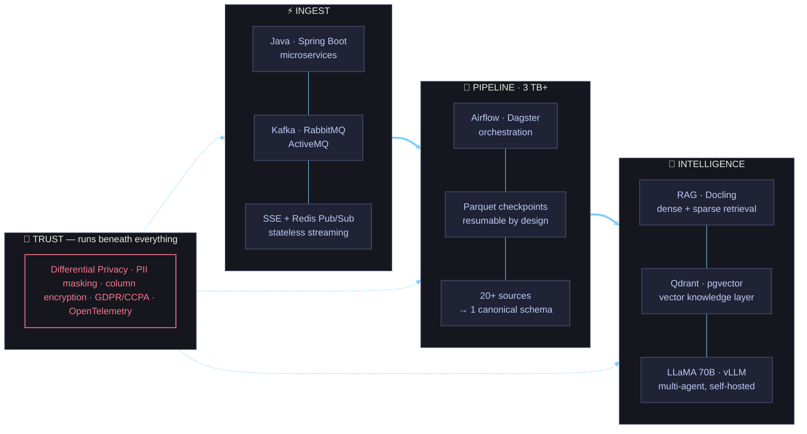
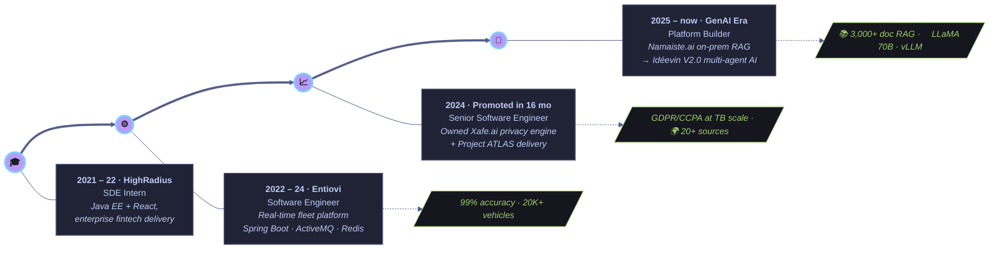

<!-- ═══════════════════════════════ HERO ═══════════════════════════════ -->


<div align="center">


<br/>

<!-- ── nav ── -->
<a href="#-how-i-think--the-stack-as-id-whiteboard-it"></a>
<a href="#-arsenal"></a>
<a href="#-flagship-builds"></a>
<a href="#-trajectory"></a>
<a href="#-numbers-that-survived-production"></a>

<br/><br/>

<a href="mailto:rhnsngh1999@gmail.com"></a>
<a href="https://www.linkedin.com/in/rohansinghin"></a>
<a href="https://portfolio.rhntech.in"></a>


</div>

<br/>

<!-- ═══════════════════════════════ ABOUT ═══════════════════════════════ -->


## ⌘ About

```yaml
role:      Senior Software Engineer @ Entiovi
years:     4+ in production distributed systems
arc:       Java backend → Data platforms → GenAI infra
promoted:  in 16 months, for end-to-end ownership

trusted_by:
  - World Bank & Stanford research programs
  - US enterprise & fintech clients

principles:
  - runtime-configurable > hardcoded
  - resumable > restartable
  - self-hosted models > leaking data
```

<br clear="right"/>

---

<!-- ═══════════════════════════════ ARCHITECTURE ═══════════════════════════════ -->
## 🧠 How I think — the stack as I'd whiteboard it

> The Arsenal below lists *what* I use. This is *how it fits together* — every system I've shipped follows this shape.



---

<!-- ═══════════════════════════════ ARSENAL ═══════════════════════════════ -->
## ⚙ Arsenal

> Not a wall of icons — this is where my depth actually sits.

<table>
<tr>
<td width="34%" valign="top" align="center">

### 🏗️ Backend & Microservices
<sub>**PRIMARY WEAPON · 4+ YEARS**</sub>

`████████████████░` 

 

   

<sub>*Event-driven services, LLD/HLD, design patterns — the layer everything else here stands on.*</sub>

</td>
<td width="33%" valign="top" align="center">

### 🤖 AI & GenAI Systems
<sub>**CURRENT FRONTIER · SHIPPING NOW**</sub>

`██████████████░░░`

 

      

<sub>*Dense + sparse retrieval, agent orchestration, privacy-gated inference — all self-hosted.*</sub>

</td>
<td width="33%" valign="top" align="center">

### 🔄 Data Engineering
<sub>**TERABYTE-SCALE · OWNED END-TO-END**</sub>

`███████████████░░`

 

    

<sub>*Checkpointed, resumable, runtime-configurable pipelines — 20+ sources, one canonical schema.*</sub>

</td>
</tr>
<tr>
<td valign="top" align="center">

### 📡 Distributed & Messaging
<sub>**BATTLE-TESTED AT FLEET SCALE**</sub>

`███████████████░░`

     

</td>
<td valign="top" align="center">

### ☁️ Cloud & DevOps
<sub>**ZERO-DOWNTIME BY DEFAULT**</sub>

`█████████████░░░░`

      

</td>
<td valign="top" align="center">

### 🔐 Security & Observability
<sub>**PRIVACY IS A FEATURE, NOT A PATCH**</sub>

`██████████████░░░`

     

</td>
</tr>
</table>

---

<!-- ═══════════════════════════════ NUMBERS ═══════════════════════════════ -->
## 📟 Numbers that survived production

<div align="center">

<table>
<tr>
<td align="center" width="25%"><h2>🛰️ 2×</h2><b>10K → 20K+ vehicles</b><br/><sub>real-time fleet, re-architected<br/>ingestion + caching paths</sub></td>
<td align="center" width="25%"><h2>🗄️ 3 TB+</h2><b>data ingested</b><br/><sub>legislative, judicial & global<br/>macro data on GCP</sub></td>
<td align="center" width="25%"><h2>🎯 99%</h2><b>data accuracy</b><br/><sub>bulk fleet ops — debugged<br/>live in production</sub></td>
<td align="center" width="25%"><h2>⚡ 30–40%</h2><b>faster syncs</b><br/><sub>parallelized DAGs,<br/>two-phase pipelines</sub></td>
</tr>
<tr>
<td align="center"><h2>🧱 40%+</h2><b>memory reclaimed</b><br/><sub>Parquet checkpoint staging,<br/>fully resumable pipelines</sub></td>
<td align="center"><h2>📚 3,000+</h2><b>docs in RAG</b><br/><sub>LLaMA 70B, fully on-prem,<br/>zero external API calls</sub></td>
<td align="center"><h2>🌍 20+</h2><b>sources unified</b><br/><sub>World Bank · IMF · GDELT<br/>WTO · Meltwater</sub></td>
<td align="center"><h2>🔻 0</h2><b>downtime releases</b><br/><sub>K8s rolling deploys,<br/>health probes, replicas</sub></td>
</tr>
</table>

</div>

---

<!-- ═══════════════════════════════ BUILDS ═══════════════════════════════ -->
## 🚀 Flagship Builds

<table>
<tr>
<td width="50%" valign="top">

#### 🌐 Project ATLAS &nbsp;<sub><sup>`World Bank · Stanford`</sup></sub>
*Global data-intelligence pipeline*

Incremental ETL on Airflow unifying **20+ heterogeneous global sources** — economic, trade, media & conflict data — into one canonical schema for research teams.

`▸` Parallelized DAGs → **30% faster sync**
`▸` DS model runs wired straight into the DAG flow
`▸` End-to-end **OpenTelemetry** observability

<sub>`Airflow` · `Python` · `Azure` · `MinIO` · `OTel`</sub>

</td>
<td width="50%" valign="top">

#### 🔐 Xafe.ai &nbsp;<sub><sup>`Platform Owner`</sup></sub>
*Privacy-preserving ETL engine*

Middleware-controlled ETL where *everything* is runtime-configurable — new sources onboard with **zero code changes**.

`▸` Differential Privacy: dynamic PII masking + column-level encryption
`▸` Parquet checkpoints → **40%+ memory cut**, resumable
`▸` SSE + Redis Pub/Sub → stateless, horizontally scalable

<sub>`Spring Boot` · `Airflow` · `Parquet` · `K8s` · `GDPR/CCPA`</sub>

</td>
</tr>
<tr>
<td width="50%" valign="top">

#### 🏛️ Project CAPITOL &nbsp;<sub><sup>`US Enterprise`</sup></sub>
*Legislative & judicial data intelligence*

Two-phase Airflow pipeline (raw sync → normalize/enrich) over **3 TB+** of US legislative, Senate & court data — with graceful API-throttle handling, while mentoring a small data team.

`▸` **40% sync-time reduction** on GCP
`▸` Document AI: **Docling + Qdrant** semantic retrieval
`▸` MinIO S3-compatible raw data lake

<sub>`Airflow` · `Docling` · `Qdrant` · `RabbitMQ` · `GCP`</sub>

</td>
<td width="50%" valign="top">

#### 🦙 Namaiste.ai → Idéevin V2.0
*Self-hosted GenAI → enterprise multi-agent AI*

RAG over **3,000+ documents** on **LLaMA 70B** — fully on-premise, not a single external LLM call. Now building the successor.

`▸` Dense + sparse chunking, sequence-tracked IDs
`▸` RabbitMQ-decoupled, fault-tolerant microservices
`▸` V2.0: Dagster + dlt · pgvector · privacy gateway · **vLLM**

<sub>`LLaMA 70B` · `vLLM` · `LangChain` · `pgvector` · `Dagster`</sub>

</td>
</tr>
</table>

---

<!-- ═══════════════════════════════ TRAJECTORY ═══════════════════════════════ -->
## 🧭 Trajectory

> Four stops. Each one a bigger system than the last.



<div align="center">
<sub>

**intern** ─── writes features&nbsp;&nbsp;→&nbsp;&nbsp;**engineer** ─── scales systems&nbsp;&nbsp;→&nbsp;&nbsp;**senior** ─── owns platforms&nbsp;&nbsp;→&nbsp;&nbsp;**builder** ─── ships AI products

</sub>
</div>

---

<!-- ═══════════════════════════════ NOW + STATS ═══════════════════════════════ -->
## 🌱 Currently

```text
shipping   ▸ Idéevin V2.0 — enterprise multi-agent AI platform
learning   ▸ agentic orchestration patterns (MCP · N8N · LangChain)
deepening  ▸ privacy gateways for LLM inference
exploring  ▸ document AI at scale with Docling
```

<div align="center">


<br/><br/>

### open to hard problems in **data infra · LLM platforms · distributed systems**

<a href="mailto:rhnsngh1999@gmail.com"></a>

</div>


