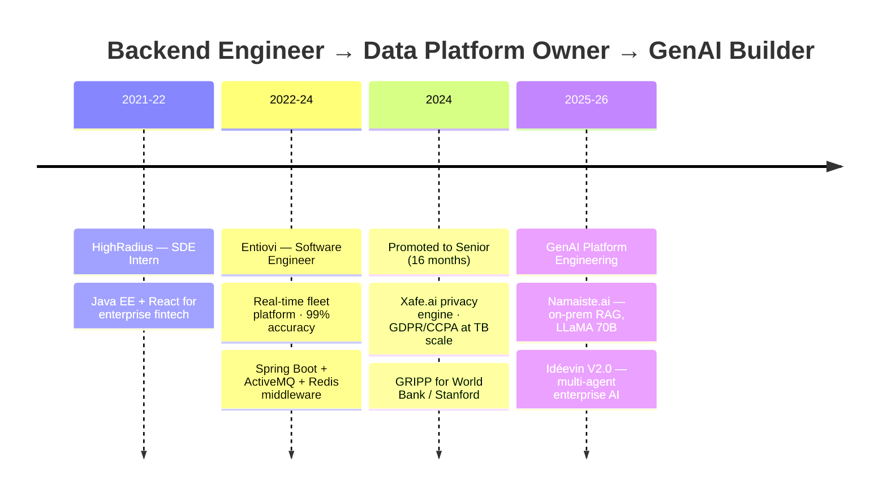

<!-- ─────────────────────────  HEADER  ───────────────────────── -->


<div align="center">

[](https://git.io/typing-svg)

<br/>

[](mailto:rhnsngh1999@gmail.com)
[](https://www.linkedin.com/in/rohansinghin)
[](https://portfolio.rhntech.in)
[](#)

</div>

<br/>

<!-- ─────────────────────────  SYSTEM DESIGN OF ME  ───────────────────────── -->
## 🧠 `system-design --of rohan`

> Every engineer has a stack. Here's mine — as the architecture diagram I'd actually draw.

```mermaid
flowchart LR
    subgraph INGEST["⚡ Ingestion Layer — 4+ yrs"]
        A1[Java · Spring Boot]
        A2[Kafka · RabbitMQ · ActiveMQ]
        A3[REST · SSE + Redis Pub/Sub]
    end

    subgraph PIPELINE["🔄 Data Platform — 3 TB+"]
        B1[Apache Airflow · Dagster]
        B2[Parquet Checkpointing]
        B3[Canonical Schema · 20+ sources]
    end

    subgraph AI["🤖 GenAI Layer"]
        C1[RAG · Docling · Qdrant · pgvector]
        C2[LLaMA 70B · vLLM · Ollama]
        C3[Multi-Agent · LangChain · MCP]
    end

    subgraph TRUST["🔐 Trust Layer"]
        D1[Differential Privacy Engine]
        D2[PII Masking · Column Encryption]
        D3[GDPR / CCPA · OpenTelemetry]
    end

    INGEST --> PIPELINE --> AI
    TRUST -.enforced across.- INGEST
    TRUST -.enforced across.- PIPELINE
    TRUST -.enforced across.- AI
```



---

<!-- ─────────────────────────  IMPACT DASHBOARD  ───────────────────────── -->
## 📟 Production Telemetry

<div align="center">

| Metric | Reading | System |
|:---|:---:|:---|
| 🛰️ Fleet scaled | `10K → 20K+ vehicles` | Real-time tracking microservices |
| 🎯 Data accuracy | `99%` | Bulk fleet operations, production |
| 🗄️ Data ingested | `3 TB+` | US legislative / Senate / court data (GCP) |
| 🌍 Sources unified | `20+` | World Bank · IMF · GDELT · WTO · Meltwater |
| ⚡ Sync time cut | `30–40%` | Parallelized Airflow DAGs |
| 🧱 Peak memory saved | `40%+` | Parquet checkpoint staging |
| 📚 Docs in RAG | `3,000+` | Self-hosted, LLaMA 70B, zero external calls |
| 🔻 Downtime on release | `0` | K8s rolling deploys + health probes |

</div>

---

<!-- ─────────────────────────  CAREER TIMELINE  ───────────────────────── -->
## 🧭 Trajectory



---

<!-- ─────────────────────────  FLAGSHIP BUILDS  ───────────────────────── -->
## 🚀 Flagship Builds

<table>
<tr>
<td width="50%" valign="top">

### 🌍 GRIPP
**Global Resilience Intelligence Platform** · *World Bank / Stanford*

Incremental ETL on Airflow unifying **20+ heterogeneous global sources** into one canonical schema for data scientists.

- Parallelized DAGs → **30% faster sync**
- DS model runs wired directly into DAG flow
- End-to-end **OpenTelemetry** observability

`Airflow` `Python` `Azure` `MinIO` `OTel`

</td>
<td width="50%" valign="top">

### 🔐 Xafe.ai
**Privacy-Preserving ETL Engine** · *Platform Owner*

Middleware-controlled ETL where *everything* is runtime-configurable — new sources onboard with **zero code changes**.

- Differential Privacy: dynamic PII masking + column-level encryption
- Parquet checkpoints → **40%+ memory cut**, fully resumable
- SSE + Redis Pub/Sub → stateless, horizontally scalable

`Spring Boot` `Airflow` `Parquet` `K8s` `GDPR/CCPA`

</td>
</tr>
<tr>
<td width="50%" valign="top">

### 🏛️ Semantic Intelligence Platform
**3 TB+ US legislative, Senate & court data** · *GCP*

Two-phase Airflow pipeline (raw sync → normalization/enrichment) with graceful API-throttle handling — while mentoring a small data engineering team.

- **40% sync time reduction**
- Document AI: **Docling + Qdrant** semantic retrieval
- MinIO S3-compatible raw data lake

`Airflow` `Docling` `Qdrant` `RabbitMQ` `GCP`

</td>
<td width="50%" valign="top">

### 🦙 Namaiste.ai → Idéevin V2.0
**Self-hosted GenAI, evolving into multi-agent AI**

RAG over **3,000+ documents** on **LLaMA 70B** — fully on-premise, not a single external LLM call. Now building the enterprise successor.

- Dense + sparse chunking with sequence-tracked IDs
- RabbitMQ-decoupled fault-tolerant microservices
- V2.0: Dagster + dlt ingestion · pgvector · privacy gateway · **vLLM** serving

`LLaMA 70B` `vLLM` `LangChain` `pgvector` `Dagster`

</td>
</tr>
</table>

---

<!-- ─────────────────────────  TECH ARSENAL  ───────────────────────── -->
## 🛠️ Arsenal

<div align="center">

**⚙️ Core Backend**


**📡 Distributed & Messaging**


**🔄 Data Engineering**


**🤖 AI / GenAI**


**☁️ Cloud & DevOps**


</div>

---

<!-- ─────────────────────────  CURRENTLY  ───────────────────────── -->
## 🌱 Currently Shipping & Learning

```text
🤖 Idéevin V2.0 — multi-agent AI    ██████████████░░  in production build
🔬 Agentic workflows (MCP · N8N)    ████████████░░░░  orchestration patterns
🔐 Privacy gateways for LLMs        ██████████████░░  policy-enforced inference
📄 Document AI (Docling)            █████████████░░░  structured extraction at scale
```

---

<!-- ─────────────────────────  GITHUB STATS  ───────────────────────── -->
## 📊 Activity

<div align="center">


[](https://github.com/rohan1769)

</div>

---

<!-- ─────────────────────────  FOOTER  ───────────────────────── -->
<div align="center">

### 💬 Let's Build Something Hard

Open to collaborating on **data engineering**, **ML/LLM infrastructure**, and gnarly **distributed systems** problems.

**Ask me about:** Airflow at scale · Spring Boot microservices · Vector search · Self-hosted LLMs · Differential privacy

<br/>

[](mailto:rhnsngh1999@gmail.com)

</div>


