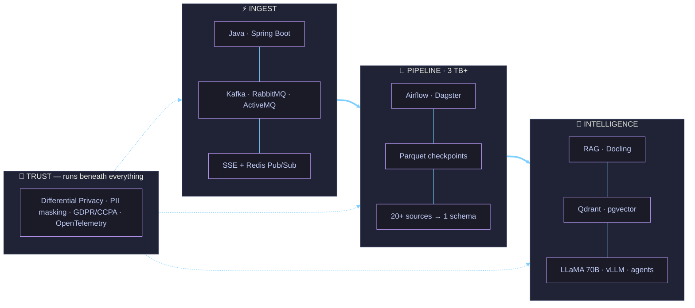
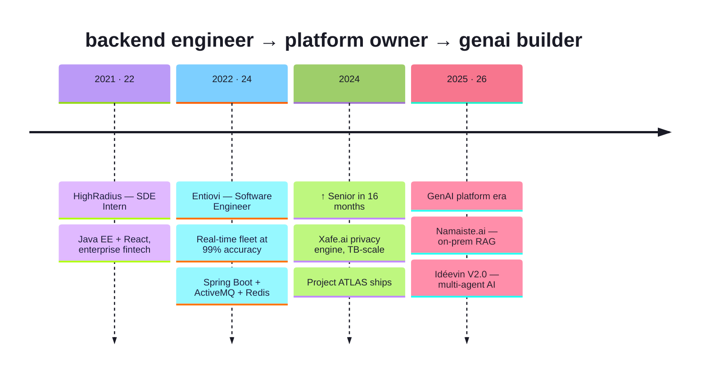

<!-- ════════════════════════ HERO ════════════════════════ -->


<div align="center">


<br/><br/>

<a href="mailto:rhnsngh1999@gmail.com"></a>&nbsp;
<a href="https://www.linkedin.com/in/rohansinghin"></a>&nbsp;
<a href="https://portfolio.rhntech.in"></a>&nbsp;


</div>

<br/>

<!-- ════════════════════════ ABOUT ════════════════════════ -->


### 〔 about 〕

```yaml
role:      Senior Software Engineer @ Entiovi
years:     4+ in production distributed systems
arc:       Java backend → Data platforms → GenAI infra
promoted:  in 16 months, for end-to-end ownership

trusted_by:
  - World Bank & Stanford research programs
  - US enterprise & fintech clients

principles:
  - runtime-configurable > hardcoded
  - resumable > restartable
  - self-hosted models > leaking data
```

<br clear="right"/>

---

<!-- ════════════════════════ ARCHITECTURE ════════════════════════ -->
### 〔 the stack, as I'd whiteboard it 〕



---

<!-- ════════════════════════ NUMBERS ════════════════════════ -->
### 〔 numbers that survived production 〕

<div align="center">

<table>
<tr>
<td align="center" width="25%"><h2>🛰️ 2×</h2><b>10K → 20K+ vehicles</b><br/><sub>real-time fleet, re-architected<br/>ingestion + caching paths</sub></td>
<td align="center" width="25%"><h2>🗄️ 3 TB+</h2><b>data ingested</b><br/><sub>legislative, judicial & global<br/>macro data on GCP</sub></td>
<td align="center" width="25%"><h2>🎯 99%</h2><b>data accuracy</b><br/><sub>bulk fleet ops — debugged<br/>live in production</sub></td>
<td align="center" width="25%"><h2>⚡ 30–40%</h2><b>faster syncs</b><br/><sub>parallelized DAGs,<br/>two-phase pipelines</sub></td>
</tr>
<tr>
<td align="center"><h2>🧱 40%+</h2><b>memory reclaimed</b><br/><sub>Parquet checkpoint staging,<br/>fully resumable pipelines</sub></td>
<td align="center"><h2>📚 3,000+</h2><b>docs in RAG</b><br/><sub>LLaMA 70B, fully on-prem,<br/>zero external API calls</sub></td>
<td align="center"><h2>🌍 20+</h2><b>sources unified</b><br/><sub>World Bank · IMF · GDELT<br/>WTO · Meltwater</sub></td>
<td align="center"><h2>🔻 0</h2><b>downtime releases</b><br/><sub>K8s rolling deploys,<br/>health probes, replicas</sub></td>
</tr>
</table>

</div>

---

<!-- ════════════════════════ PROJECTS ════════════════════════ -->
### 〔 classified builds — codenames only 〕

<table>
<tr>
<td width="50%" valign="top">

#### 🌐 Project ATLAS &nbsp;<sub><sup>`World Bank · Stanford`</sup></sub>
*Global data-intelligence pipeline*

Incremental ETL on Airflow unifying **20+ heterogeneous global sources** — economic, trade, media & conflict data — into one canonical schema for research teams.

`▸` Parallelized DAGs → **30% faster sync**
`▸` DS model runs wired straight into the DAG flow
`▸` End-to-end **OpenTelemetry** observability

<sub>`Airflow` · `Python` · `Azure` · `MinIO` · `OTel`</sub>

</td>
<td width="50%" valign="top">

#### 🔐 Xafe.ai &nbsp;<sub><sup>`Platform Owner`</sup></sub>
*Privacy-preserving ETL engine*

Middleware-controlled ETL where *everything* is runtime-configurable — new sources onboard with **zero code changes**.

`▸` Differential Privacy: dynamic PII masking + column-level encryption
`▸` Parquet checkpoints → **40%+ memory cut**, resumable
`▸` SSE + Redis Pub/Sub → stateless, horizontally scalable

<sub>`Spring Boot` · `Airflow` · `Parquet` · `K8s` · `GDPR/CCPA`</sub>

</td>
</tr>
<tr>
<td width="50%" valign="top">

#### 🏛️ Project CAPITOL &nbsp;<sub><sup>`US Enterprise`</sup></sub>
*Legislative & judicial data intelligence*

Two-phase Airflow pipeline (raw sync → normalize/enrich) over **3 TB+** of US legislative, Senate & court data — with graceful API-throttle handling, while mentoring a small data team.

`▸` **40% sync-time reduction** on GCP
`▸` Document AI: **Docling + Qdrant** semantic retrieval
`▸` MinIO S3-compatible raw data lake

<sub>`Airflow` · `Docling` · `Qdrant` · `RabbitMQ` · `GCP`</sub>

</td>
<td width="50%" valign="top">

#### 🦙 Namaiste.ai → Idéevin V2.0
*Self-hosted GenAI → enterprise multi-agent AI*

RAG over **3,000+ documents** on **LLaMA 70B** — fully on-premise, not a single external LLM call. Now building the successor.

`▸` Dense + sparse chunking, sequence-tracked IDs
`▸` RabbitMQ-decoupled, fault-tolerant microservices
`▸` V2.0: Dagster + dlt · pgvector · privacy gateway · **vLLM**

<sub>`LLaMA 70B` · `vLLM` · `LangChain` · `pgvector` · `Dagster`</sub>

</td>
</tr>
</table>

---

<!-- ════════════════════════ TIMELINE ════════════════════════ -->
### 〔 trajectory 〕



---

<!-- ════════════════════════ STACK ════════════════════════ -->
### 〔 arsenal 〕

<div align="center">


<br/><br/>

              

</div>

---

<!-- ════════════════════════ NOW ════════════════════════ -->
### 〔 currently 〕

<table>
<tr>
<td>

```text
shipping   ▸ Idéevin V2.0 — enterprise multi-agent AI platform
learning   ▸ agentic orchestration patterns (MCP · N8N · LangChain)
deepening  ▸ privacy gateways for LLM inference
exploring  ▸ document AI at scale with Docling
```

</td>
</tr>
</table>

<br/>

<div align="center">


<br/><br/>

### open to hard problems in **data infra · LLM platforms · distributed systems**

<a href="mailto:rhnsngh1999@gmail.com"></a>

</div>


